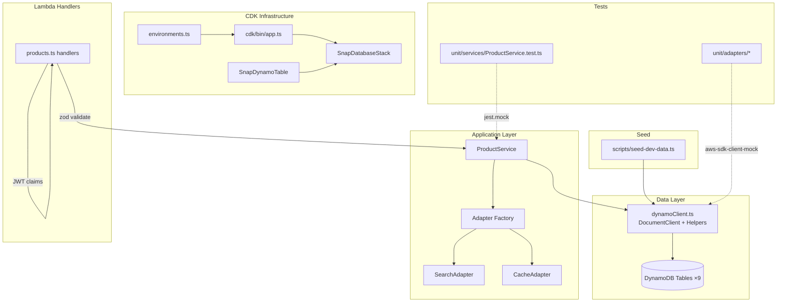
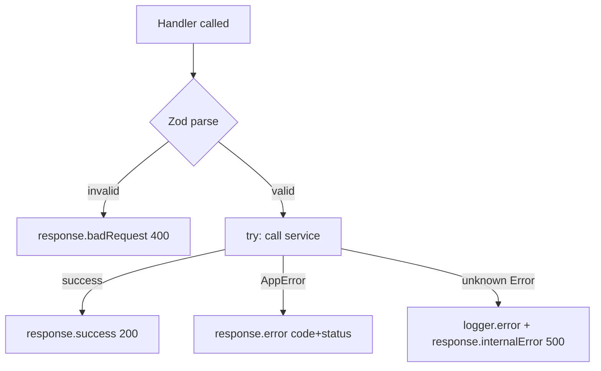

# Design Document — Amazon Now Snap Backend Scaffold

## Overview

This document describes the technical design for the core backend scaffold of **Amazon Now Snap**, a quick-commerce serverless backend on AWS. The scaffold covers five ordered layers: CDK infrastructure, dev seed data, DynamoDB client helpers, the product service and handlers, and unit tests for adapters and the product service.

The existing codebase already supplies the adapter factory, six adapter implementations, a structured logger (`@utils/logger`), a response formatter (`@utils/response`), and error constants (`@constants/errors`). This design extends that base without altering any existing files except `src/clients/dynamoClient.ts`, where new helper exports are appended.

**Key constraints honoured throughout:**
- TypeScript strict mode — `noImplicitAny`, `strictNullChecks`, no `any` escapes
- No `console.log` — all logging via `logger` from `@utils/logger`
- All monetary values as integers in paise; all timestamps as ISO 8601 UTC strings
- `userId` sourced exclusively from JWT claims (`event.requestContext.authorizer?.jwt?.claims?.sub`)
- Zod validation before any business logic in handlers
- Exactly one top-level `try/catch` per handler, ≤ 40 lines per handler body

---

## Architecture



### Deployment Modes

The adapter factory (`src/adapters/factory.ts`) selects implementations at cold-start based on `ENABLE_*` environment flags. The scaffold targets **Hackathon Mode** (DynamoDB for search/cache, rule-based recommendations, keyword intent), but the design is mode-agnostic — the product service and handlers consume only the adapter interfaces.

### Request Flow

```
API Gateway → Lambda Handler → zod validation → ProductService → DynamoHelpers / Adapters → DynamoDB
```

Error propagation follows a strict hierarchy:
1. Zod failures → `response.badRequest(error.errors[0].message)` — no service call made
2. `AppError` from service → `response.error(code, message, statusCode, retryable)`
3. Unknown error → `logger.error(...)` + `response.internalError()`

---

## Components and Interfaces

### 1. CDK Infrastructure

#### `cdk/config/environments.ts`

```typescript
import { RemovalPolicy } from 'aws-cdk-lib';

export interface EnvironmentConfig {
  account: string;
  region: string;
  stage: string;
  tablePrefix: string;
  removalPolicy: RemovalPolicy;
}

// Returns config for the given stage name.
// Throws a descriptive error for unrecognised stage values.
export function getEnvironmentConfig(env: string): EnvironmentConfig;

// Named exports consumed by cdk/bin/app.ts
export const devConfig: EnvironmentConfig;
export const stagingConfig: EnvironmentConfig;
export const prodConfig: EnvironmentConfig;
```

Mapping rules:
| env        | tablePrefix | removalPolicy        |
|------------|-------------|----------------------|
| `dev`      | `"Dev-"`    | `RemovalPolicy.DESTROY` |
| `staging`  | `"Staging-"`| `RemovalPolicy.DESTROY` |
| `prod`     | `""`        | `RemovalPolicy.RETAIN`  |

`account` reads from `process.env.CDK_DEFAULT_ACCOUNT ?? ''`.  
`region` reads from `process.env.CDK_DEFAULT_REGION ?? 'ap-south-1'`.  
Any other `env` value causes an immediate `throw new Error(...)` naming the bad value and listing `['dev', 'staging', 'prod']`.

#### `cdk/constructs/SnapDynamoTable.ts`

```typescript
import { Construct } from 'constructs';
import { TableV2, AttributeType, TableEncryptionV2 } from 'aws-cdk-lib/aws-dynamodb';
import { RemovalPolicy } from 'aws-cdk-lib';

export interface SnapDynamoTableProps {
  tableName: string;           // 3–255 chars, [a-zA-Z0-9._-]
  partitionKey: { name: string; type: AttributeType };
  sortKey?: { name: string; type: AttributeType };
  removalPolicy: RemovalPolicy;
}

export class SnapDynamoTable extends Construct {
  public readonly table: TableV2;  // exposed for callers to add GSIs / streams

  constructor(scope: Construct, id: string, props: SnapDynamoTableProps);
}
```

All tables created by this construct receive:
- `billingMode`: `BILLING_MODE.PAY_PER_REQUEST` (via `TableV2` on-demand default)
- `pointInTimeRecovery`: `true`
- `encryption`: `TableEncryptionV2.awsManagedKey()`
- `removalPolicy`: from props (validated in `environments.ts` before reaching here)

The `env` context check is performed inside the construct constructor via `this.node.tryGetContext('env')`. If the value is absent or not in `['dev', 'staging', 'prod']`, the constructor throws synchronously before any CDK resource is synthesised.

#### `cdk/stacks/SnapDatabaseStack.ts`

Creates all nine tables using `SnapDynamoTable`, then calls `.table.addGlobalSecondaryIndex(...)` and `.table.addLocalSecondaryIndex(...)` as required. Streams are enabled by passing `stream: StreamViewType.NEW_AND_OLD_IMAGES` in the table's `tableProps`. TTL is enabled via `timeToLiveAttribute`.

Nine tables (all prefixed with `config.tablePrefix`):

| Logical name        | PK (type)              | SK (type)           | GSIs                                          | Streams | TTL attr |
|---------------------|------------------------|---------------------|-----------------------------------------------|---------|----------|
| `SnapUsers`         | `userId` (S)           | —                   | `EmailIndex` (PK: `email` S, ALL)             | —       | —        |
| `SnapAddresses`     | `userId` (S)           | `addressId` (S)     | —                                             | —       | —        |
| `SnapProducts`      | `productId` (S)        | `sku` (S)           | `CategoryIndex` (PK: `category` S, SK: `subCategory` S, ALL), `BrandIndex` (PK: `brand` S, SK: `productId` S, KEYS_ONLY) | `NEW_AND_OLD_IMAGES` | — |
| `SnapInventory`     | `pincodeProductId` (S) | —                   | `PincodeIndex` (PK: `pincode` S, SK: `productId` S, INCLUDE: `isAvailableFor10Min`, `stockLevel`, `darkStoreId`) | `NEW_AND_OLD_IMAGES` | — |
| `SnapOrders`        | `userId` (S)           | `orderId` (S)       | `StatusIndex` (PK: `status` S, SK: `createdAt` S, INCLUDE: `userId`, `orderId`, `total`, `pincode`, `darkStoreId`) | — | — |
| `SnapPurchaseCadence` | `userId` (S)         | `productId` (S)     | —                                             | —       | `ttl`    |
| `SnapDarkStores`    | `darkStoreId` (S)      | —                   | `CityIndex` (PK: `city` S, SK: `darkStoreId` S, ALL) | — | — |
| `SnapCache`         | `cacheKey` (S)         | —                   | —                                             | —       | `ttl`    |
| `SnapSearchIndex`   | `token` (S)            | `productId` (S)     | `CategoryIndex` (PK: `category` S, SK: `token` S, ALL) | — | — |

#### `cdk/bin/app.ts`

Entry point logic:

```typescript
const app = new cdk.App();
const envName = app.node.tryGetContext('env') ?? 'dev';
const config = getEnvironmentConfig(envName); // throws on bad env
new SnapDatabaseStack(app, `SnapDatabaseStack-${config.stage}`, {
  env: { account: config.account, region: config.region },
  config,
});
```

---

### 2. Seed Script — `scripts/seed-dev-data.ts`

The script connects to DynamoDB (respecting `DYNAMODB_ENDPOINT` for local mode), writes fixed seed data, and uses `ConditionExpression: 'attribute_not_exists(#pk)'` to skip existing records. On completion it logs a per-table summary via `logger.info`.

**Data volumes:**
- 3 dark stores (fixed IDs, cities, pincodes, avgPickupMinutes as specified)
- 50 products (15 grocery, 10 medicines, 10 snacks, 10 household, 5 baby)
  - Each product: realistic Indian name/brand, price+mrp in paise, ≥5 tags, rekognitionLabels, barcodes
- 50 × 6 = 300 inventory records (40 in-stock at stockLevel 50, 10 unavailable at stockLevel 0)
- Search index tokens: tokenize each product's name + brand + tags → one row per (token, productId) pair
- 5 test users (exact IDs and totalOrders/smartCartTier as specified)
- Purchase cadence for `test_user_regular` and `test_user_power` (≥10 products each, totalPurchases ≥3, avgIntervalDays 2–7, ≥3 purchaseDates)

**Idempotency mechanism:**
```typescript
await docClient.send(new PutCommand({
  TableName: tableName,
  Item: item,
  ConditionExpression: 'attribute_not_exists(#pk)',
  ExpressionAttributeNames: { '#pk': partitionKeyAttribute },
}));
// ConditionalCheckFailedException → caught and counted as "skipped"
// All other errors → re-thrown
```

**Run command** (already in `package.json`): `npm run seed:dev` → `ts-node scripts/seed-dev-data.ts`

---

### 3. DynamoDB Client Helpers — additions to `src/clients/dynamoClient.ts`

All six helper functions are appended below the existing `TABLE_NAMES` export. They share the existing `docClient` singleton.

```typescript
// ============================================================================
// DynamoDB Helper Functions
// ============================================================================

export async function getItem<T>(
  tableName: string,
  key: Record<string, unknown>
): Promise<T | null>;

export async function putItem<T extends Record<string, unknown>>(
  tableName: string,
  item: T
): Promise<void>;

export async function updateItem(
  tableName: string,
  key: Record<string, unknown>,
  updateExpression: string,
  expressionAttributeValues: Record<string, unknown>,
  expressionAttributeNames?: Record<string, string>,
  conditionExpression?: string
): Promise<void>;

export async function deleteItem(
  tableName: string,
  key: Record<string, unknown>
): Promise<void>;

export async function queryItems<T>(params: {
  tableName: string;
  keyConditionExpression: string;
  expressionAttributeValues: Record<string, unknown>;
  expressionAttributeNames?: Record<string, string>;
  indexName?: string;
  limit?: number;
  exclusiveStartKey?: Record<string, unknown>;
  scanIndexForward?: boolean;
}): Promise<{ items: T[]; nextCursor?: string }>;

export async function batchGetItems<T>(
  tableName: string,
  keys: Record<string, unknown>[]
): Promise<T[]>;
```

**Cursor encoding** (`queryItems`):
- When `LastEvaluatedKey` is present: `nextCursor = Buffer.from(JSON.stringify(lek)).toString('base64')`
- Callers decode via: `JSON.parse(Buffer.from(cursor, 'base64').toString())`

**Batch chunking** (`batchGetItems`):
- Splits `keys` into chunks of 100 via `for (let i = 0; i < keys.length; i += 100)`
- Runs `Promise.all` over all chunks
- Merges results from all `Responses[tableName]` arrays

**Error wrapping** (all six helpers):
```typescript
} catch (error) {
  logger.error({ message: 'DynamoDB error', tableName, error });
  throw new AppError(ErrorCodes.DATABASE_ERROR, (error as Error).message, 500, true);
}
```
Only errors that originate from the DynamoDB SDK `send()` call are wrapped. Errors from argument construction (e.g., `JSON.stringify` failure) bubble up unwrapped.

---

### 4. Product Layer

#### `src/models/Product.ts`

```typescript
/**
 * All monetary fields (price, mrp) store whole-integer paise values.
 * 1 INR = 100 paise. No decimal component is permitted.
 */
export interface Product { ... }
export interface ProductSummary { ... }
export interface InventoryStatus { ... }
export interface SearchResult extends ProductSummary { score: number; }
export interface BarcodeResult { productId: string; barcode: string; product: Product; }
```

Full field list per interface:

**`Product`**: `productId`, `sku`, `name`, `brand`, `category`, `subCategory`, `description`, `imageUrls: string[]`, `price: number` (paise), `mrp: number` (paise), `unit`, `tags: string[]`, `weight`, `barcodes: string[]`, `rekognitionLabels: string[]`, `isAvailable`, `createdAt`, `updatedAt`

**`ProductSummary`**: `productId`, `name`, `brand`, `category`, `subCategory`, `price: number` (paise), `mrp: number` (paise), `unit`, `imageUrls: string[]`, `tags: string[]`, `isAvailable`

**`InventoryStatus`**: `productId`, `pincode`, `isAvailableFor10Min`, `stockLevel`, `darkStoreId`, `cachedAt` (ISO 8601 UTC)

**`SearchResult extends ProductSummary`**: `+ score: number` (non-negative; integer token-match count in hackathon mode)

**`BarcodeResult`**: `productId`, `barcode`, `product: Product`

#### `src/services/ProductService.ts`

```typescript
import { getItem, queryItems } from '@clients/dynamoClient';
import { searchAdapter, cacheAdapter } from '@adapters/factory';
import { logger } from '@utils/logger';
import { AppError, ErrorCodes } from '@constants/errors';
import { Product, SearchResult } from '@models/Product';

export async function getProductById(productId: string): Promise<Product>;
export async function searchProducts(
  query: string, pincode: string, category?: string, limit?: number
): Promise<SearchResult[]>;
export async function getTrendingProducts(
  pincode: string, limit?: number
): Promise<SearchResult[]>;
export async function getProductByBarcode(barcode: string): Promise<Product>;
```

**`getProductById`**: `getItem<Product>(TABLE_NAMES.PRODUCTS, { productId })` → if null, `throw new AppError(ErrorCodes.PRODUCT_NOT_FOUND, 'Product not found', 404)`

**`searchProducts`**: delegates directly to `searchAdapter.search(query, pincode, category, limit ?? 20)`, returns result unchanged.

**`getTrendingProducts`**: cache-first pattern
```
cacheKey = 'trending:' + pincode
hit  → return cached value
miss → getTrending(pincode, limit ?? 10) → cacheAdapter.set(cacheKey, result, 900) → return result
```
Cache errors (get or set) are silently swallowed: `catch (e) { logger.error({ message: 'Cache error', error: e }); }` — execution continues on the non-cache path.

**`getProductByBarcode`**: cache-first pattern
```
cacheKey = 'barcode:' + barcode
hit  → return cached Product
miss → queryItems on SnapProducts BarcodeIndex (PK: barcode)
         → found: cacheAdapter.set(cacheKey, product, 3600) → return product
         → not found: throw AppError(PRODUCT_NOT_FOUND, 404)
```
Same silent cache-error swallowing applies.

**50-line rule**: `getTrendingProducts` and `getProductByBarcode` extract the cache-read/write logic into a shared private helper `withCache<T>(key, ttl, loader)` to stay within 50 lines each.

#### `src/handlers/products.ts`

Four exports: `getProduct`, `searchProductsHandler`, `getTrendingHandler`, `getBarcodeHandler`.

All handlers share the same structural skeleton:
```typescript
export const handlerName: APIGatewayProxyHandlerV2 = async (event) => {
  const userId = event.requestContext.authorizer?.jwt?.claims?.sub as string | undefined;
  const requestId = event.requestContext.requestId;

  // 1. Parse inputs from event
  // 2. Zod parse → on ZodError: return response.badRequest(error.errors[0].message)
  try {
    // 3. Call service
    // 4. return response.success(...)
  } catch (error) {
    if (error instanceof AppError) {
      return response.error(error.code, error.message, error.statusCode, error.retryable);
    }
    logger.error({ message: 'Unhandled error', error, requestId, userId });
    return response.internalError();
  }
};
```

Zod schemas per handler:

**`getProduct`**: `z.object({ productId: z.string().min(1) })`  
**`searchProductsHandler`**:
```typescript
z.object({
  q: z.string().min(2),
  pincode: z.string().regex(/^\d{6}$/),
  category: z.string().optional(),
  limit: z.coerce.number().int().min(1).max(50).optional(),
})
```
**`getTrendingHandler`**: `z.object({ pincode: z.string().regex(/^\d{6}$/) })`  
**`getBarcodeHandler`**: `z.object({ code: z.string().min(1) })`

Response shapes:
- `getProduct` → `response.success(product)`
- `searchProductsHandler` → `response.success({ results, count: results.length })`
- `getTrendingHandler` → `response.success({ products, count: products.length })`
- `getBarcodeHandler` → `response.success(product)`

---

### 5. Unit Tests

#### Test infrastructure

```
tests/
  unit/
    adapters/
      DynamoCacheAdapter.test.ts
      KeywordIntentAdapter.test.ts
      RuleBasedRecommendationAdapter.test.ts
    services/
      ProductService.test.ts
```

All tests use:
- `aws-sdk-client-mock` (`mockClient(DynamoDBDocumentClient)`) for DynamoDB operations
- `jest.mock('@adapters/factory')` for service-layer tests
- `beforeEach(() => { mock.reset(); jest.clearAllMocks(); })`

#### `DynamoCacheAdapter.test.ts` — test cases

| Scenario | Mock returns | Expected |
|----------|-------------|----------|
| `get` — fresh hit | `{ Item: { cacheKey, value: JSON.stringify(data), ttl: now+3600 } }` | Returns `data` deep-equal to input |
| `get` — expired TTL | `{ Item: { ..., ttl: now-1 } }` | Returns `null` |
| `get` — key missing | `{ Item: undefined }` | Returns `null` |
| `get` — SDK throws | `mock.rejects(new Error())` | Returns `null`, no throw |
| `set` — happy path | mock resolves | `PutCommand` called with `value: JSON.stringify(v)` and `ttl` within ±2s of `now+ttlSeconds` |
| `set` — SDK throws | `mock.rejects(new Error())` | Does not throw |
| `del` — happy path | mock resolves | `DeleteCommand` called with `Key: { cacheKey: key }` |
| `del` — SDK throws | `mock.rejects(new Error())` | Does not throw |
| `mget` — mixed hits/misses | varied Items | Result array same length as input; hits return values, misses/expired return null |

#### `KeywordIntentAdapter.test.ts` — test cases

Fixture: 3 products in `ScanCommand` response, each with distinct names.

| Scenario | Query | Expected |
|----------|-------|----------|
| High confidence | Tokens = exact subset of one product's name | `confidence >= 0.75`, `alternatives = []` |
| Medium confidence | Token matches 2+ products | `0.50 <= confidence < 0.75`, `alternatives.length` 1–2 |
| No match | Token absent in all products | `resolvedBy: 'none'`, `suggestedInput` = normalized tokens |
| All stopwords | `"the a an"` | `resolvedBy: 'none'`, `confidence: 0`, no throw |
| SDK throws | `mock.rejects(new Error())` | `resolvedBy: 'none'`, `confidence: 0`, no throw |

#### `RuleBasedRecommendationAdapter.test.ts` — test cases

| Scenario | `GetCommand` returns | Expected tier |
|----------|---------------------|---------------|
| New user | `{ totalOrders: 0 }` | `"trending"` |
| Edge Tier-1 | `{ totalOrders: 4 }` | `"trending"` |
| Edge Tier-2 start | `{ totalOrders: 5 }` | `"hybrid"` |
| Mid Tier-2 | `{ totalOrders: 19 }` | `"hybrid"` |
| Tier-3 start | `{ totalOrders: 20 }` | `"personalize"` |
| Power user | `{ totalOrders: 120 }` | `"personalize"` |
| User not found | `{ Item: undefined }` | `"trending"`, no throw |
| SDK throws | `mock.rejects(...)` | `"trending"`, no throw |
| `getRecommendations`: all cache null | `mget → [null, null, ...]` | `[]` |
| `getRecommendations`: all `isAvailableFor10Min: false` | `mget → [{isAvailableFor10Min: false}, ...]` | `[]` |

#### `ProductService.test.ts` — test cases

Mocks: `jest.mock('@clients/dynamoClient')` (mock `getItem`, `queryItems`), `jest.mock('@adapters/factory')` (mock `searchAdapter`, `cacheAdapter`).

| Scenario | Mocks | Expected |
|----------|-------|----------|
| `getProductById` — found | `getItem` returns product fixture | Returns same product |
| `getProductById` — not found | `getItem` returns `null` | Throws `AppError` `PRODUCT_NOT_FOUND` 404 |
| `searchProducts` — delegates unchanged | `searchAdapter.search` returns fixture array | Returns same array |
| `getTrendingProducts` — cache hit | `cacheAdapter.get` returns fixture | Returns cached value, `searchAdapter.getTrending` NOT called |
| `getTrendingProducts` — cache miss | `cacheAdapter.get` returns `null` | Calls `getTrending`, calls `cacheAdapter.set(key, result, 900)`, returns result |
| `getProductByBarcode` — cache hit | `cacheAdapter.get` returns product fixture | Returns cached product, `queryItems` NOT called |
| `getProductByBarcode` — cache miss, found | `cacheAdapter.get` null, `queryItems` returns `[product]` | Calls `cacheAdapter.set('barcode:X', product, 3600)`, returns product |
| `getProductByBarcode` — cache miss, not found | `cacheAdapter.get` null, `queryItems` returns `[]` | Throws `AppError` `PRODUCT_NOT_FOUND` 404 |
| Cache throws on `getTrendingProducts` | `cacheAdapter.get` throws | Error swallowed; falls through to adapter call |
| Cache throws on `getProductByBarcode` | `cacheAdapter.set` throws | Error swallowed; product returned normally |

---

## Data Models

### DynamoDB Table Access Patterns

```
SnapProducts:
  getProductById     → GetItem (PK: productId)
  getProductByBarcode → QueryItems on BarcodeIndex (PK: barcode) ← via queryItems helper
  searchProducts     → via DynamoSearchAdapter → SnapSearchIndex
  getTrending        → via DynamoSearchAdapter (Scan with filter)

SnapSearchIndex:
  search(query)      → QueryItems (PK: token) for each token in query, merge by productId, rank by count

SnapInventory:
  filterInStock      → BatchGetItems (keys: pincodeProductId = pincode + '#' + productId)

SnapCache:
  All cache ops      → GetItem / PutItem / DeleteItem / BatchGetItem (PK: cacheKey)
```

### Key Composition

`SnapInventory.pincodeProductId` = `${pincode}#${productId}` — composite key avoids a GSI for the common inventory-check access pattern.

### Cursor Encoding

```
nextCursor = Buffer.from(JSON.stringify(LastEvaluatedKey)).toString('base64')
// Caller decodes: JSON.parse(Buffer.from(cursor, 'base64').toString())
```

### Monetary Values

All `price` and `mrp` fields are `number` typed as whole-integer paise. The seed script enforces this:
```typescript
// ₹32.50 → 3250 (integer, no decimal)
price: 3250,  // ✓
price: 32.50, // ✗ never
```

---

## Correctness Properties

*A property is a characteristic or behavior that should hold true across all valid executions of a system — essentially, a formal statement about what the system should do. Properties serve as the bridge between human-readable specifications and machine-verifiable correctness guarantees.*

**Property-based testing applicability assessment**: This feature includes pure business-logic functions (DynamoDB helper wrappers, cursor encoding, chunking, service delegation, handler input validation, userId extraction) that operate over large input spaces. PBT is appropriate for these functions. The CDK infrastructure, model interfaces, and code-structure requirements (line counts, JSDoc) are not suitable for PBT and are covered by snapshot/example/compile-time checks instead.

**PBT library**: [`fast-check`](https://github.com/dubzzz/fast-check) — mature TypeScript-first PBT library. Install with `npm install --save-dev fast-check`.

Each property test must run a minimum of 100 iterations (fast-check default is 100; use `{ numRuns: 100 }` explicitly). Tag format: `// Feature: amazon-now-snap-backend-scaffold, Property N: <text>`.

---

### Property 1: Environment config throws on any unrecognised env value

*For any* string that is not `"dev"`, `"staging"`, or `"prod"`, calling `getEnvironmentConfig(env)` should throw an error, and the error message should contain both the invalid value and at least one of the three valid option names.

**Validates: Requirements 2.7, 1.7**

---

### Property 2: queryItems nextCursor is a reversible Base64 encoding of LastEvaluatedKey

*For any* `LastEvaluatedKey` object produced by a DynamoDB query (an object with string or number values), the `nextCursor` string returned by `queryItems` when `LastEvaluatedKey` is present should decode back to an equivalent object via `JSON.parse(Buffer.from(cursor, 'base64').toString())`.

**Validates: Requirements 6.7**

---

### Property 3: batchGetItems invokes BatchGetCommand exactly ceil(N/100) times

*For any* array of `N` keys passed to `batchGetItems`, the function should invoke `BatchGetCommand` exactly `Math.ceil(N / 100)` times, and the union of all keys across all invocations should be identical to the input key set.

**Validates: Requirements 6.8**

---

### Property 4: DynamoDB helper errors are always wrapped as AppError DATABASE_ERROR

*For any* DynamoDB SDK error thrown by the `docClient.send()` call inside any helper (`getItem`, `putItem`, `updateItem`, `deleteItem`, `queryItems`, `batchGetItems`), the error re-thrown by the helper should be an instance of `AppError` with `code === ErrorCodes.DATABASE_ERROR`, `statusCode === 500`, and `retryable === true`.

**Validates: Requirements 6.10**

---

### Property 5: searchProducts returns the adapter's result unchanged

*For any* array of `SearchResult` objects returned by `searchAdapter.search`, `productService.searchProducts(query, pincode)` should return the exact same array (reference equality or deep equality) without modification.

**Validates: Requirements 8.2**

---

### Property 6: Cache errors in ProductService are silently swallowed

*For any* error thrown by `cacheAdapter.get` or `cacheAdapter.set`, the `getTrendingProducts` and `getProductByBarcode` functions should complete their execution path without propagating the cache error — the functions should either return a valid result (by falling through to the adapter/DB) or throw only a non-cache `AppError`.

**Validates: Requirements 8.5**

---

### Property 7: Validation-failing inputs never reach the service layer

*For any* handler invocation where the input fails zod schema validation (e.g., `pincode` not matching `/^\d{6}$/`, `q` shorter than 2 characters, `limit` outside 1–50), the handler should return HTTP status 400 and the corresponding service function should never have been called.

**Validates: Requirements 9.5**

---

### Property 8: userId is always taken from JWT claims, never from other event fields

*For any* handler invocation, the `userId` value used in logging and service calls must equal `event.requestContext.authorizer?.jwt?.claims?.sub` — even when the event body, path parameters, or query string parameters contain a different `userId` field.

**Validates: Requirements 9.8**

---

**Property reflection — redundancy check:**

- Properties 2 and 3 are distinct: Property 2 tests encoding correctness; Property 3 tests call-count and key-coverage. No overlap.
- Properties 5 and 6 are distinct: Property 5 tests pass-through fidelity; Property 6 tests error isolation. No overlap.
- Properties 7 and 8 are distinct: Property 7 tests the validation gate; Property 8 tests the userId source. No overlap.
- Property 4 is independent from all others (error wrapping logic).
- Property 1 is independent (config validation).

No consolidation needed; all eight properties provide unique validation value.

---

## Error Handling

### Error Hierarchy

```
AppError (typed, structured)
  ├── PRODUCT_NOT_FOUND    (404, retryable: false) — product not in DB
  ├── DATABASE_ERROR       (500, retryable: true)  — DynamoDB SDK failure
  └── (others from ErrorCodes as needed by future services)

ZodError (validation, converted to badRequest before AppError check)
  └── response.badRequest(error.errors[0].message) → HTTP 400

Unknown Error
  └── logger.error + response.internalError() → HTTP 500
```

### Handler Error Flow



### Cache Error Isolation

`CacheAdapter` errors are treated as non-fatal in `ProductService`. The cache is a performance optimization, not a correctness dependency:

```typescript
let cached: T | null = null;
try {
  cached = await cacheAdapter.get<T>(key);
} catch (e) {
  logger.error({ message: 'Cache error', error: e });
  // execution continues — cached remains null
}
```

### DynamoDB Error Wrapping

Every DynamoDB helper wraps SDK errors as `AppError(DATABASE_ERROR, ..., 500, true)`. This ensures the handler's `AppError` branch (not the generic 500 branch) handles predictable infrastructure failures, allowing the response to include `retryable: true` for client retry logic.

---

## Testing Strategy

### Dual Testing Approach

| Test type | Tool | What it covers |
|-----------|------|----------------|
| Unit — example-based | Jest + ts-jest | Specific scenarios, error paths, CDK config mappings |
| Unit — property-based | fast-check | Universal properties over large input spaces |
| Integration | Jest + DynamoDB Local | Seed script idempotency, end-to-end helper round-trips |
| CDK snapshot | `aws-cdk-lib/assertions` | Table schema, GSI config, billing mode, encryption |

### Property-Based Testing Configuration

```typescript
import fc from 'fast-check';

// Each property test runs 100 iterations minimum
fc.assert(
  fc.property(arbitraryInput, (input) => {
    // ... assertion
  }),
  { numRuns: 100 }
);
```

Tag comment above each property test:
```typescript
// Feature: amazon-now-snap-backend-scaffold, Property N: <property text>
```

### Unit Test Patterns

**Adapter tests** — use `aws-sdk-client-mock`:
```typescript
import { mockClient } from 'aws-sdk-client-mock';
import { DynamoDBDocumentClient, GetCommand } from '@aws-sdk/lib-dynamodb';

const ddbMock = mockClient(DynamoDBDocumentClient);
beforeEach(() => ddbMock.reset());

ddbMock.on(GetCommand).resolves({ Item: { ... } });
```

**Service tests** — use `jest.mock`:
```typescript
jest.mock('@clients/dynamoClient', () => ({
  getItem: jest.fn(),
  queryItems: jest.fn(),
  TABLE_NAMES: { PRODUCTS: 'Dev-SnapProducts' },
}));
jest.mock('@adapters/factory', () => ({
  searchAdapter: { search: jest.fn(), getTrending: jest.fn() },
  cacheAdapter: { get: jest.fn(), set: jest.fn() },
}));
```

### Coverage Requirements

Jest coverage thresholds (already in `package.json`):
- Branches: 80%
- Functions: 80%
- Lines: 80%
- Statements: 80%

The new service and handler files are included in coverage collection via `src/**/*.ts`. Adapter tests cover the three hackathon adapters. Service tests cover all four `ProductService` functions including cache hit/miss and error paths.

### CDK Snapshot Tests

CDK infrastructure is tested with `aws-cdk-lib/assertions`:
```typescript
import { Template } from 'aws-cdk-lib/assertions';

const template = Template.fromStack(stack);
template.hasResourceProperties('AWS::DynamoDB::GlobalTable', {
  BillingMode: 'PAY_PER_REQUEST',
  PointInTimeRecoverySpecification: { PointInTimeRecoveryEnabled: true },
});
```

These tests live in `tests/unit/cdk/` and are run as part of the standard Jest suite.
