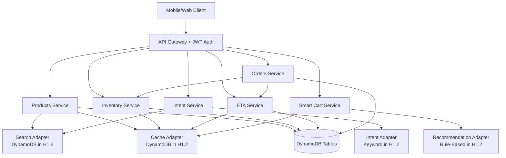
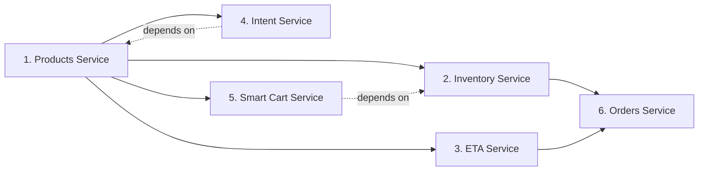
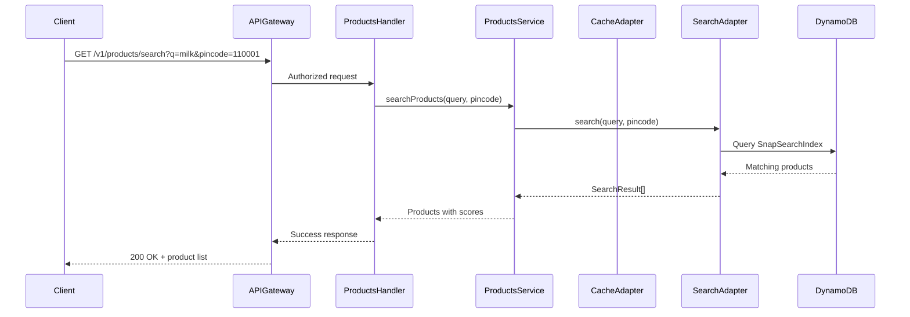
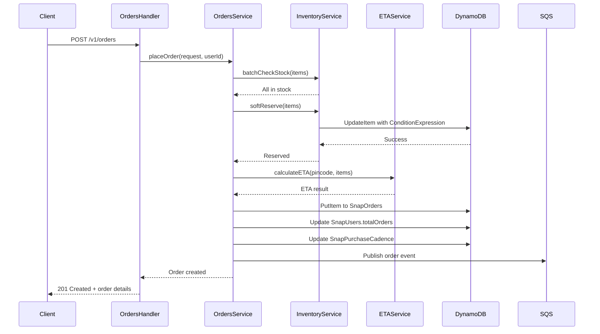
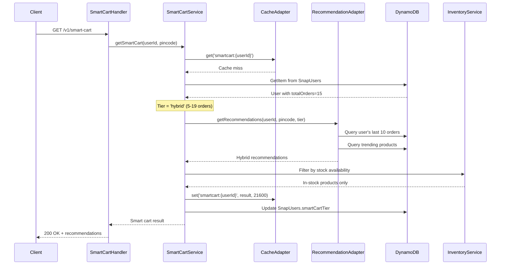
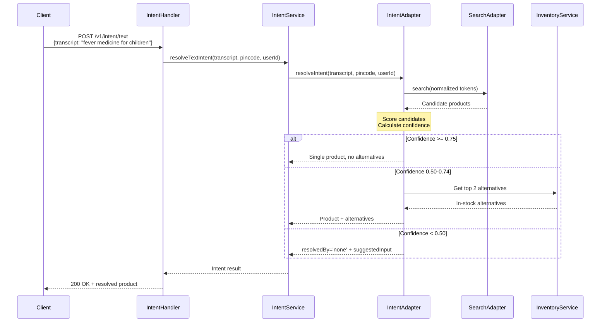

# Design Document: Phase H1.2 - Core API Implementation

## Overview

Phase H1.2 implements six core REST API services for the Amazon Now Snap application in Hackathon Mode (free-tier, DynamoDB-based). These services form the backbone of the product ordering system, handling product discovery, inventory management, delivery estimates, intent resolution, personalized recommendations, and order placement.

All services follow the adapter factory pattern established in Phase H1.1, allowing seamless transition to production AI/ML services when `ENABLE_*` flags are enabled. The services operate in strict dependency order: Products → Inventory → ETA → Intent → Smart Cart → Orders, ensuring each service can leverage previously implemented capabilities.

## Architecture

### System Context



### Service Dependency Flow



## Components and Interfaces

### 1. Products Service

**Purpose**: Product catalog management with search, barcode lookup, and trending products.

**Routes**:
- `GET /v1/products/{id}` - Get product by ID
- `GET /v1/products/barcode/{code}` - Fast barcode lookup
- `GET /v1/products/trending?pincode={pincode}` - Trending products by location
- `GET /v1/products/search?q={query}&pincode={pincode}&category={category}` - Product search

**Service Interface**:
```typescript
interface ProductsService {
  getProductById(productId: string): Promise<Product>;
  getProductByBarcode(barcode: string): Promise<Product>;
  getTrendingProducts(pincode: string, limit: number): Promise<Product[]>;
  searchProducts(query: string, pincode: string, category?: string, limit?: number): Promise<SearchResult[]>;
}
```

**Dependencies**:
- SearchAdapter (DynamoSearchAdapter in H1.2)
- CacheAdapter (DynamoCacheAdapter in H1.2)
- DynamoDB SnapProducts table

**Caching Strategy**:
- Product details: 1 hour TTL (`product:{productId}`)
- Barcode mappings: 1 hour TTL (`barcode:{barcodeValue}`)
- Trending products: 15 minutes TTL (`trending:{pincode}`)

### 2. Inventory Service

**Purpose**: Real-time stock level management with soft-reserve capability for checkout flow.

**Routes**:
- `GET /v1/inventory/{pincode}/{productId}` - Check single product stock
- `POST /v1/inventory/batch-check` - Check multiple products (batch operation)

**Service Interface**:
```typescript
interface InventoryService {
  checkStock(pincode: string, productId: string): Promise<InventoryStatus>;
  batchCheckStock(pincode: string, productIds: string[]): Promise<InventoryStatus[]>;
  softReserve(pincode: string, productId: string, quantity: number, userId: string): Promise<boolean>;
  releaseReservation(pincode: string, productId: string, userId: string): Promise<void>;
}

interface InventoryStatus {
  productId: string;
  pincode: string;
  isAvailableFor10Min: boolean;
  stockLevel: number;
  darkStoreId: string;
}
```

**Dependencies**:
- CacheAdapter (30-second TTL for inventory)
- DynamoDB SnapInventory table

**Soft-Reserve Logic**:
- On checkout initiation: increment `reservedUnits` with conditional write
- Condition: `stockLevel > reservedUnits` (prevents overselling)
- Reservation expires after 90 seconds if payment not completed
- Cleanup Lambda (EventBridge every 5 minutes) releases expired reservations

### 3. ETA Service

**Purpose**: Delivery time estimation based on dark store location and order processing time.

**Routes**:
- `GET /v1/eta?pincode={pincode}&productId={productId}` - Single product ETA
- `POST /v1/eta/batch` - Batch ETA calculation

**Service Interface**:
```typescript
interface ETAService {
  calculateETA(pincode: string, productId: string): Promise<ETAResult>;
  batchCalculateETA(pincode: string, productIds: string[]): Promise<ETAResult[]>;
}

interface ETAResult {
  etaMinutes: number;
  etaAt: string; // ISO 8601 absolute time
  darkStoreId: string;
  label: string; // "8–10 minutes"
}
```

**Dependencies**:
- CacheAdapter (60-second TTL for ETA calculations)
- DynamoDB SnapDarkStores table
- DynamoDB SnapInventory table (for darkStoreId lookup)

**Calculation Logic**:
1. Lookup dark store serving the pincode
2. Get `avgPickupMinutes` from dark store config
3. Add fixed last-mile delivery estimate (based on distance)
4. Cache result with 60-second TTL

### 4. Intent Service

**Purpose**: Resolve user intent from text or voice input to product recommendations.

**Routes**:
- `POST /v1/intent/text` - Text-based intent resolution
- `POST /v1/intent/voice` - Voice transcript intent resolution

**Service Interface**:
```typescript
interface IntentService {
  resolveTextIntent(transcript: string, pincode: string, userId: string): Promise<IntentResult>;
  resolveVoiceIntent(transcript: string, pincode: string, userId: string): Promise<IntentResult>;
}

interface IntentResult {
  productId: string;
  name: string;
  brand: string;
  price: number;
  imageUrl: string;
  confidence: number; // 0.0 to 1.0
  reason: string;
  resolvedBy: 'text' | 'voice' | 'none';
  alternatives?: Product[]; // When confidence 0.50-0.74
  suggestedInput?: string; // When confidence < 0.50
}
```

**Dependencies**:
- IntentAdapter (KeywordIntentAdapter in H1.2)
- SearchAdapter (for candidate products)

**Confidence Threshold Rules**:
- ≥ 0.75: Return single product, no alternatives
- 0.50–0.74: Return single product + up to 2 alternatives
- < 0.50: Graceful failure, return `resolvedBy: 'none'` with suggested input

### 5. Smart Cart Service

**Purpose**: Personalized product recommendations based on user order history and tier.

**Routes**:
- `GET /v1/smart-cart` - Get personalized recommendations
- `POST /v1/smart-cart/refresh` - Force refresh recommendations

**Service Interface**:
```typescript
interface SmartCartService {
  getSmartCart(userId: string, pincode: string): Promise<SmartCartResult>;
  refreshSmartCart(userId: string, pincode: string): Promise<SmartCartResult>;
}

interface SmartCartResult {
  userId: string;
  pincode: string;
  tier: 'trending' | 'hybrid' | 'personalize';
  label: string;
  suggestions: Recommendation[];
  generatedAt: string; // ISO 8601
}
```

**Dependencies**:
- RecommendationAdapter (RuleBasedRecommendationAdapter in H1.2)
- CacheAdapter (6-hour TTL for smart cart)
- DynamoDB SnapUsers table (for totalOrders tier check)
- DynamoDB SnapPurchaseCadence table (for Tier 3 frequency sorting)

**Tier Logic**:
- **Tier 1** (0–4 orders): Trending products with label "Popular Near You"
- **Tier 2** (5–19 orders): Hybrid (50% user history + 50% trending) with label "Based on Your Orders"
- **Tier 3** (20+ orders): Frequency-sorted from purchase cadence with label "Your Smart Cart"

All recommendations filtered by in-stock status via InventoryService.

### 6. Orders Service

**Purpose**: Order placement, retrieval, and reorder functionality with payment integration.

**Routes**:
- `POST /v1/orders` - Place new order
- `GET /v1/orders` - Get order history (paginated)
- `GET /v1/orders/{id}` - Get single order details
- `GET /v1/orders/recent` - Get last 5 orders
- `POST /v1/orders/{id}/reorder` - Reorder with substitutes

**Service Interface**:
```typescript
interface OrdersService {
  placeOrder(orderRequest: OrderRequest, userId: string): Promise<Order>;
  getOrderHistory(userId: string, cursor?: string, limit?: number): Promise<OrderHistoryResult>;
  getOrder(userId: string, orderId: string): Promise<Order>;
  getRecentOrders(userId: string): Promise<Order[]>;
  reorder(userId: string, orderId: string): Promise<Order>;
}

interface OrderRequest {
  items: Array<{ productId: string; quantity: number }>;
  addressId: string;
  paymentMethod: 'amazon_pay' | 'cod';
}

interface Order {
  orderId: string;
  userId: string;
  status: 'PLACED' | 'CONFIRMED' | 'PICKED' | 'OUT_FOR_DELIVERY' | 'DELIVERED' | 'CANCELLED';
  items: OrderItem[];
  subtotal: number; // In paise
  deliveryFee: number; // In paise
  total: number; // In paise
  addressSnapshot: Address;
  pincode: string;
  darkStoreId: string;
  etaMinutes: number;
  etaAt: string; // ISO 8601
  paymentId: string;
  paymentMethod: string;
  intentSource: string;
  createdAt: string; // ISO 8601
  updatedAt: string; // ISO 8601
}
```

**Dependencies**:
- InventoryService (for final stock validation and soft-reserve)
- ETAService (for delivery time calculation)
- DynamoDB SnapOrders table
- DynamoDB SnapUsers table (to update totalOrders counter)
- DynamoDB SnapPurchaseCadence table (to update purchase patterns)
- SQS snap-order-events-queue (for downstream notifications)

**Order Placement Flow**:
1. Validate all items in stock via InventoryService
2. Soft-reserve all items (90-second lock)
3. Calculate ETA via ETAService
4. Process payment (mock in H1.2)
5. Write order to DynamoDB with unique orderId
6. Update user totalOrders counter
7. Update purchase cadence for each product
8. Publish order event to SQS
9. Release soft-reserve or let it expire

## Data Models

### Product Model

```typescript
interface Product {
  productId: string;
  sku: string;
  name: string;
  brand: string;
  category: string;
  subCategory: string;
  description: string;
  imageUrls: string[];
  price: number; // Paise (1 INR = 100 paise)
  mrp: number; // Paise
  unit: string; // "500ml", "1kg", "1 unit"
  tags: string[];
  weight: number; // Grams
  barcodes: string[];
  isAvailable: boolean;
  createdAt: string; // ISO 8601
  updatedAt: string; // ISO 8601
}
```

### Inventory Model

```typescript
interface InventoryRecord {
  pincodeProductId: string; // Composite: "{pincode}#{productId}"
  pincode: string;
  productId: string;
  darkStoreId: string;
  stockLevel: number;
  isAvailableFor10Min: boolean;
  reservedUnits: number;
  reservationExpiresAt: string; // ISO 8601
  lastSyncedAt: string; // ISO 8601
  updatedAt: string; // ISO 8601
}
```

### Order Model

```typescript
interface OrderRecord {
  userId: string; // PK
  orderId: string; // SK: "ord_{timestamp}_{uuid}"
  status: OrderStatus;
  items: OrderItem[];
  subtotal: number; // Paise
  deliveryFee: number; // Paise
  total: number; // Paise
  addressId: string;
  addressSnapshot: Address;
  pincode: string;
  darkStoreId: string;
  etaMinutes: number;
  etaAt: string; // ISO 8601
  deliveredAt?: string; // ISO 8601
  paymentId: string;
  paymentMethod: 'amazon_pay' | 'cod';
  intentSource: 'photo' | 'voice' | 'smart_cart' | 'reorder' | 'manual' | 'barcode' | 'text';
  createdAt: string; // ISO 8601
  updatedAt: string; // ISO 8601
}

type OrderStatus = 
  | 'PLACED' 
  | 'CONFIRMED' 
  | 'PICKED' 
  | 'OUT_FOR_DELIVERY' 
  | 'DELIVERED' 
  | 'CANCELLED';

interface OrderItem {
  productId: string;
  name: string;
  quantity: number;
  priceAtOrder: number; // Paise (snapshot at order time)
  imageUrl: string;
}
```

### Smart Cart Model

```typescript
interface SmartCartRecord {
  userId: string;
  pincode: string;
  tier: 'trending' | 'hybrid' | 'personalize';
  suggestions: Recommendation[];
  generatedAt: string; // ISO 8601
}

interface Recommendation {
  productId: string;
  name: string;
  brand: string;
  price: number; // Paise
  imageUrl: string;
  confidence: number; // 0.0 to 1.0
  reason: string; // "You buy this every 2-3 days"
}
```

### Purchase Cadence Model

```typescript
interface PurchaseCadence {
  userId: string; // PK
  productId: string; // SK
  totalPurchases: number;
  firstPurchasedAt: string; // ISO 8601
  lastPurchasedAt: string; // ISO 8601
  purchaseDates: string[]; // Last 10 purchase timestamps
  avgIntervalDays: number;
  nextPredictedAt: string; // ISO 8601
  alertSentAt?: string; // ISO 8601
  updatedAt: string; // ISO 8601
  ttl: number; // Unix epoch (expires 1 year after last purchase)
}
```

### Dark Store Model

```typescript
interface DarkStore {
  darkStoreId: string; // PK
  name: string;
  city: string;
  latitude: number;
  longitude: number;
  serviceablePincodes: string[];
  avgPickupMinutes: number;
  isOperational: boolean;
  operatingHours: {
    open: string; // "06:00"
    close: string; // "00:00"
  };
  updatedAt: string; // ISO 8601
}
```

## Sequence Diagrams

### Product Search Flow



### Order Placement Flow



### Smart Cart Generation Flow



### Intent Resolution Flow



## Error Handling

### Error Response Format

All services follow the standard error response envelope:

```typescript
interface ErrorResponse {
  success: false;
  data: null;
  error: {
    code: string;
    message: string;
    details?: unknown;
  };
  requestId: string;
  timestamp: string; // ISO 8601
}
```

### Error Scenarios

#### Products Service Errors

| Error Code | HTTP Status | Condition | Response |
|------------|-------------|-----------|----------|
| `PRODUCT_NOT_FOUND` | 404 | Product ID doesn't exist | "Product not found" |
| `BARCODE_NOT_FOUND` | 404 | Barcode not in catalog | "No product found for barcode" |
| `INVALID_PINCODE` | 400 | Invalid pincode format | "Pincode must be 6 digits" |
| `SEARCH_FAILED` | 500 | Search adapter error | "Search temporarily unavailable" |

#### Inventory Service Errors

| Error Code | HTTP Status | Condition | Response |
|------------|-------------|-----------|----------|
| `OUT_OF_STOCK` | 422 | Stock level zero or reserved | "Product out of stock" |
| `RESERVATION_FAILED` | 422 | Conditional write failed | "Unable to reserve stock" |
| `INVALID_QUANTITY` | 400 | Quantity < 1 or > 99 | "Quantity must be between 1 and 99" |
| `STOCK_CHECK_FAILED` | 500 | DynamoDB error | "Stock check temporarily unavailable" |

#### Orders Service Errors

| Error Code | HTTP Status | Condition | Response |
|------------|-------------|-----------|----------|
| `ORDER_NOT_FOUND` | 404 | Order doesn't exist for user | "Order not found" |
| `PAYMENT_FAILED` | 422 | Payment processing error | "Payment could not be processed" |
| `ADDRESS_NOT_FOUND` | 400 | Invalid address ID | "Delivery address not found" |
| `EMPTY_CART` | 400 | No items in order request | "Order must contain at least one item" |
| `DUPLICATE_ORDER` | 409 | Duplicate orderId detected | "Order already exists" |

#### Smart Cart Service Errors

| Error Code | HTTP Status | Condition | Response |
|------------|-------------|-----------|----------|
| `USER_NOT_FOUND` | 404 | User doesn't exist | "User profile not found" |
| `RECOMMENDATION_FAILED` | 500 | Adapter error | "Recommendations temporarily unavailable" |
| `NO_PRODUCTS_AVAILABLE` | 422 | All recommendations out of stock | "No products available in your area" |

#### Intent Service Errors

| Error Code | HTTP Status | Condition | Response |
|------------|-------------|-----------|----------|
| `EMPTY_TRANSCRIPT` | 400 | Empty or whitespace-only input | "Intent input cannot be empty" |
| `INTENT_RESOLUTION_FAILED` | 500 | Adapter error | "Intent resolution temporarily unavailable" |
| `NO_MATCH_FOUND` | 200 | Confidence < 0.50 | Return `resolvedBy: 'none'` |

#### ETA Service Errors

| Error Code | HTTP Status | Condition | Response |
|------------|-------------|-----------|----------|
| `PINCODE_NOT_SERVICEABLE` | 422 | No dark store serves pincode | "Delivery not available in this area" |
| `DARKSTORE_OFFLINE` | 503 | Dark store not operational | "Service temporarily unavailable" |
| `ETA_CALCULATION_FAILED` | 500 | Calculation error | "ETA calculation failed" |

### Error Handling Pattern

All Lambda handlers follow this pattern:

```typescript
export const handler = async (event: APIGatewayProxyEventV2): Promise<APIGatewayProxyResultV2> => {
  try {
    const userId = event.requestContext.authorizer?.jwt?.claims?.sub as string;
    const requestId = event.requestContext.requestId;
    
    // Business logic
    const result = await service.someMethod(params);
    
    return response.success(result);
  } catch (error) {
    logger.error({ 
      error, 
      requestId: event.requestContext.requestId,
      service: 'service-name',
      userId 
    });
    
    if (error instanceof AppError) {
      return response.error(error.code, error.message, error.statusCode);
    }
    
    return response.error('INTERNAL_ERROR', 'An unexpected error occurred', 500);
  }
};
```

## Testing Strategy

### Unit Testing Approach

**Scope**: Test each service function in isolation with mocked dependencies.

**Coverage Goals**:
- All service methods: 100% coverage
- All error paths tested
- All adapter interactions mocked
- Edge cases (empty inputs, invalid formats, boundary values)

**Test Structure**:
```
src/services/__tests__/
  productsService.test.ts
  inventoryService.test.ts
  etaService.test.ts
  intentService.test.ts
  smartCartService.test.ts
  ordersService.test.ts
```

**Key Test Cases per Service**:

*Products Service*:
- Get product by valid ID
- Get product by invalid ID (404)
- Barcode lookup hit and miss
- Search with results and no results
- Trending products with cache hit/miss

*Inventory Service*:
- Stock check with cache hit/miss
- Batch stock check
- Soft-reserve success and failure (conditional write)
- Reservation expiry cleanup

*Orders Service*:
- Successful order placement
- Order placement with out-of-stock item
- Payment failure handling
- Reorder with all items available
- Reorder with substitutes needed

*Smart Cart Service*:
- Tier 1 user (0-4 orders) gets trending
- Tier 2 user (5-19 orders) gets hybrid
- Tier 3 user (20+ orders) gets frequency-sorted
- Cache hit scenario
- All recommendations out of stock

*Intent Service*:
- High confidence (≥0.75) returns single product
- Medium confidence (0.50-0.74) returns product + alternatives
- Low confidence (<0.50) returns graceful failure
- Empty transcript handling

*ETA Service*:
- Valid pincode with operational dark store
- Pincode not serviceable
- Dark store offline
- Cache hit scenario

### Integration Testing Approach

**Scope**: Test each API route end-to-end with real DynamoDB Local and mock adapters.

**Test Environment**:
- DynamoDB Local (Docker)
- Mocked adapter implementations
- Seed data: 50 products, 3 dark stores, 5 test users, 10 test orders

**Test Structure**:
```
src/handlers/__tests__/
  products.integration.test.ts
  inventory.integration.test.ts
  eta.integration.test.ts
  intent.integration.test.ts
  smartCart.integration.test.ts
  orders.integration.test.ts
```

**Key Integration Test Cases**:

*API Route Tests*:
- All routes return correct HTTP status codes
- All routes return standard response envelope
- JWT authorization works correctly
- Invalid JWT returns 401
- Missing required parameters return 400

*End-to-End Flows*:
- Complete order flow: search → check stock → place order
- Reorder flow: get order → reorder → verify new order created
- Smart cart flow: get cart → verify tier matches order count
- Intent flow: resolve text → verify product returned → check stock

*Error Scenarios*:
- DynamoDB connection failure returns 500
- Invalid input validation returns 400
- Resource not found returns 404
- Business rule violation returns 422

*Concurrency Tests*:
- Multiple concurrent stock checks return correct results
- Concurrent soft-reserve attempts (last-unit race condition)
- Cache invalidation during concurrent reads

## Performance Considerations

### Response Time Targets

| Route | P50 Target | P95 Target | P99 Target |
|-------|------------|------------|------------|
| GET /v1/products/{id} | < 50ms | < 100ms | < 150ms |
| GET /v1/products/barcode/{code} | < 50ms | < 100ms | < 150ms |
| GET /v1/products/search | < 200ms | < 400ms | < 600ms |
| GET /v1/inventory/{pincode}/{productId} | < 30ms | < 50ms | < 100ms |
| POST /v1/inventory/batch-check | < 100ms | < 200ms | < 300ms |
| GET /v1/eta | < 50ms | < 100ms | < 150ms |
| POST /v1/intent/text | < 300ms | < 500ms | < 800ms |
| GET /v1/smart-cart | < 100ms | < 200ms | < 400ms |
| POST /v1/orders | < 500ms | < 800ms | < 1200ms |
| GET /v1/orders | < 100ms | < 200ms | < 300ms |

### Caching Strategy

**Cache Keys and TTLs**:
- `product:{productId}` - 3600s (1 hour)
- `barcode:{barcodeValue}` - 3600s (1 hour)
- `trending:{pincode}` - 900s (15 minutes)
- `inv:{pincode}:{productId}` - 30s
- `smartcart:{userId}` - 21600s (6 hours)
- `eta:{pincode}:{darkStoreId}` - 60s
- `reservation:{pincode}:{productId}:{userId}` - 90s

**Cache Invalidation**:
- Product updates → invalidate `product:{productId}` and `barcode:{barcode}`
- Inventory updates → invalidate `inv:{pincode}:{productId}`
- Order placement → invalidate `smartcart:{userId}`
- Reservation expiry → automatic TTL expiration

### Database Optimization

**DynamoDB Access Patterns**:
- Products: GetItem by PK (productId) - O(1)
- Inventory: GetItem by composite PK (pincodeProductId) - O(1)
- Orders: Query by PK (userId) + SK (orderId) - O(log n)
- Search: GSI Query on CategoryIndex - O(log n) with FilterExpression

**Batch Operations**:
- Inventory batch check: Parallel DynamoDB GetItem (max 25 concurrent)
- ETA batch calculation: Parallel lookups with Promise.all
- Smart cart: Single Query with pagination for order history

**Connection Pooling**:
- DynamoDB client: Reuse across Lambda invocations (warm start)
- Cache adapter: Connection pooling for DynamoDB cache table
- Maximum 50 concurrent connections per Lambda

### Lambda Configuration

**Memory Allocation**:
- Products Service: 512 MB
- Inventory Service: 512 MB
- ETA Service: 256 MB
- Intent Service: 1024 MB (token processing)
- Smart Cart Service: 512 MB
- Orders Service: 1024 MB (multiple writes)

**Timeout Settings**:
- Products Service: 10 seconds
- Inventory Service: 10 seconds
- ETA Service: 5 seconds
- Intent Service: 15 seconds
- Smart Cart Service: 15 seconds
- Orders Service: 30 seconds

**Reserved Concurrency**:
- Development: None (use account-level concurrency)
- Production: Set per service based on load testing results

## Security Considerations

### Authentication and Authorization

**JWT Validation**:
- All routes require valid JWT from Cognito User Pool
- API Gateway JWT Authorizer validates tokens before Lambda invocation
- userId extracted from JWT claims, never from request body

**Authorization Rules**:
- Users can only access their own orders
- Users can only access their own smart cart
- Product and inventory routes are user-agnostic (read-only)

### Input Validation

**Request Validation**:
- All inputs validated using Zod schemas before processing
- Pincode format: exactly 6 digits
- Product IDs: UUID format validation
- Quantity: integer between 1 and 99
- Search query: max 200 characters, sanitized

**Injection Prevention**:
- No raw SQL (DynamoDB only)
- All DynamoDB expressions use ExpressionAttributeValues
- User input never concatenated into queries
- All string inputs trimmed and sanitized

### Data Protection

**PII Handling**:
- User emails and phones encrypted at rest in DynamoDB
- No PII logged to CloudWatch (use redacted placeholders)
- Address snapshots in orders contain only delivery-necessary fields
- Payment IDs logged but never card numbers or sensitive payment data

**Secrets Management**:
- No secrets in code or environment variables
- AWS Secrets Manager for production credentials
- SSM Parameter Store for non-secret configuration
- `.env` files only for local development (in `.gitignore`)

### IAM Policies

**Least Privilege Principle**:
- Each Lambda has dedicated IAM role
- DynamoDB permissions: specific table ARNs only
- No wildcard resource permissions in production
- SQS permissions: specific queue ARNs only

**Example Policy** (Products Service):
```json
{
  "Version": "2012-10-17",
  "Statement": [
    {
      "Effect": "Allow",
      "Action": [
        "dynamodb:GetItem",
        "dynamodb:Query"
      ],
      "Resource": [
        "arn:aws:dynamodb:ap-south-1:*:table/Dev-SnapProducts",
        "arn:aws:dynamodb:ap-south-1:*:table/Dev-SnapCache"
      ]
    },
    {
      "Effect": "Allow",
      "Action": [
        "logs:CreateLogGroup",
        "logs:CreateLogStream",
        "logs:PutLogEvents"
      ],
      "Resource": "arn:aws:logs:ap-south-1:*:log-group:/aws/lambda/snap-products-*"
    }
  ]
}
```

### Rate Limiting

**API Gateway Throttling**:
- Development: 100 requests/second per user
- Production: 500 requests/second per user
- Burst capacity: 1000 concurrent requests

**DynamoDB Throttling**:
- On-demand billing mode (no manual provisioning)
- Automatic scaling based on traffic
- CloudWatch alarms for ThrottledRequests metric

## Dependencies

### External Services

**AWS Services**:
- API Gateway HTTP API v2 (JWT Authorizer)
- Lambda Functions (Node.js 20.x runtime)
- DynamoDB (on-demand billing)
- SQS (for order events)
- CloudWatch Logs (90-day retention)
- CloudWatch Metrics (for monitoring)

**Adapter Dependencies** (Hackathon Mode):
- DynamoCacheAdapter (uses SnapCache table)
- DynamoSearchAdapter (uses SnapSearchIndex table)
- KeywordIntentAdapter (no external service)
- RuleBasedRecommendationAdapter (DynamoDB only)
- BarcodeVisionAdapter (client-side barcode detection)
- BrowserSpeechAdapter (client-side speech-to-text)

### NPM Packages

**Core Dependencies**:
```json
{
  "@aws-sdk/client-dynamodb": "^3.x",
  "@aws-sdk/lib-dynamodb": "^3.x",
  "@aws-sdk/client-sqs": "^3.x",
  "zod": "^3.x",
  "uuid": "^9.x"
}
```

**Development Dependencies**:
```json
{
  "@types/node": "^20.x",
  "@types/aws-lambda": "^8.x",
  "typescript": "^5.x",
  "jest": "^29.x",
  "@types/jest": "^29.x",
  "eslint": "^8.x",
  "prettier": "^3.x"
}
```

### Internal Dependencies

**Shared Utilities**:
- `src/utils/logger.ts` - Structured JSON logging
- `src/utils/response.ts` - Standard response formatter
- `src/constants/errors.ts` - Error code definitions
- `src/clients/dynamoClient.ts` - DynamoDB client wrapper

**Adapter Factory**:
- `src/adapters/factory.ts` - Adapter instantiation
- `src/adapters/interfaces.ts` - Adapter contracts
- `src/adapters/cache/DynamoCacheAdapter.ts`
- `src/adapters/search/DynamoSearchAdapter.ts`
- `src/adapters/intent/KeywordIntentAdapter.ts`
- `src/adapters/recommendation/RuleBasedRecommendationAdapter.ts`

### Service Dependencies

```
Orders Service
  ├─ Inventory Service (stock validation, soft-reserve)
  ├─ ETA Service (delivery time calculation)
  └─ Products Service (indirect, via product IDs)

Smart Cart Service
  ├─ Recommendation Adapter
  ├─ Cache Adapter
  └─ Inventory Service (stock filtering)

Intent Service
  ├─ Intent Adapter
  └─ Search Adapter (product candidates)

Inventory Service
  └─ Cache Adapter

Products Service
  ├─ Search Adapter
  └─ Cache Adapter

ETA Service
  └─ Cache Adapter
```
